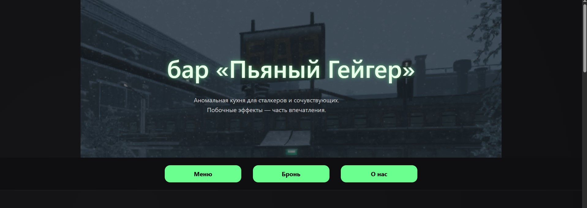
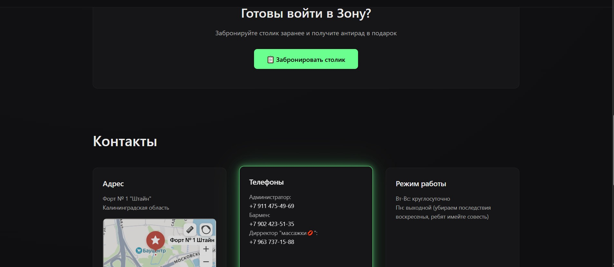
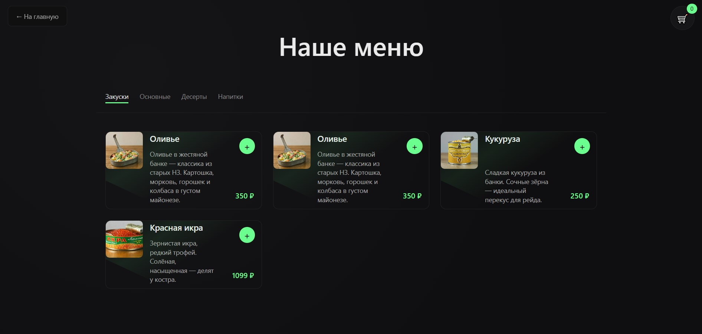
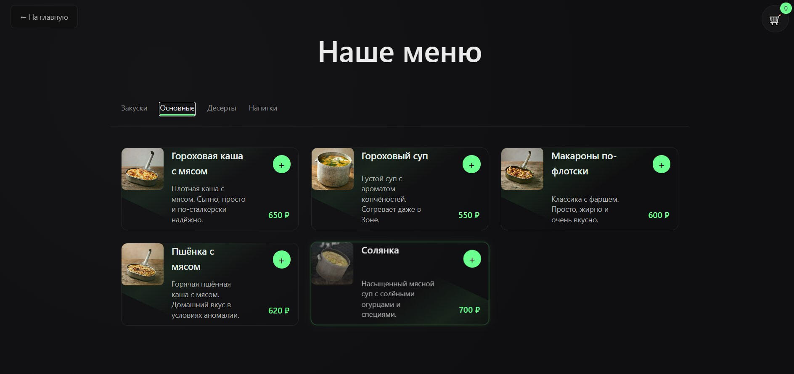
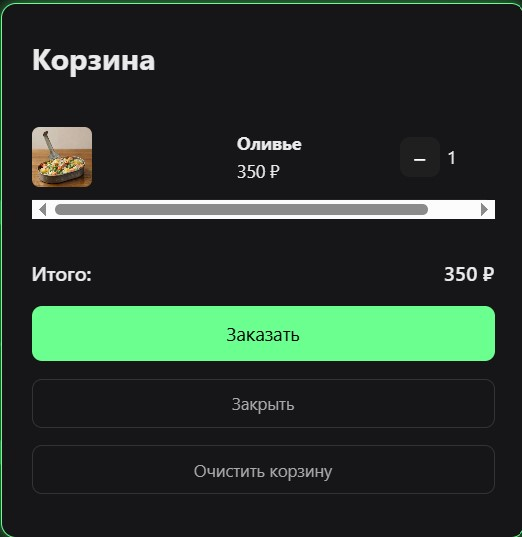
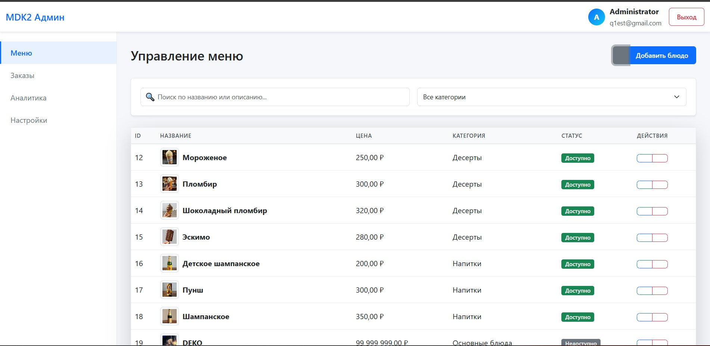
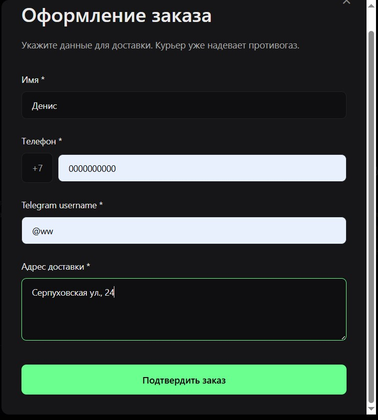
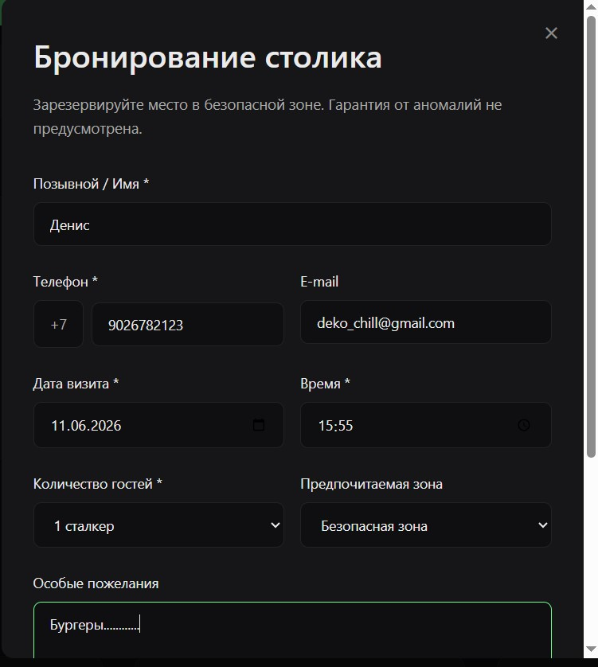

# MDK2 — Сервис заказа блюд

**Ссылки на проект:**
-  Сайт: https://q1est.github.io/mdk2/
-  Админка: https://qwefsdfsdsg-mdk.hf.space/admin/login.html


MDK2 — учебный fullstack-проект сервиса заказа блюд из ресторана.

Проект разработан для получения практического опыта создания клиент-серверных приложений, работы с базами данных, контейнеризацией и командной разработкой.

Пользователь может просматривать меню ресторана, добавлять блюда в корзину и оформлять заказ. Заказы обрабатываются серверной частью и сохраняются в базе данных.


## Основные возможности

### Клиентская часть

* Просмотр меню ресторана
* Категории блюд
* Просмотр карточек товаров
* Добавление блюд в корзину
* Изменение количества товаров
* Подсчёт итоговой стоимости заказа
* Оформление заказа

### Серверная часть

* REST API на Go
* Обработка заказов и бронирований
* Валидация данных
* Работа с PostgreSQL
* Логирование запросов

### Инфраструктура

* Docker-контейнеризация
* Grafana Loki для сбора логов
* Supabase Storage для хранения изображений
* Автоматический CD через GitHub Actions


## Технологический стек

### Frontend

* HTML5
* CSS3
* JavaScript

### Backend

* Go
* REST API
* HTTP Server

### Database

* PostgreSQL

### Storage

* Supabase Bucket

### DevOps

* Docker
* Docker Compose
* Grafana Loki


## Архитектура проекта

```
│   .gitattributes
│   Dockerfile
│   fd187128-9d20-46c0-ae0a-c34719b2113b.png
│   images.jpg
│   index.html
│   menu.html
│   promo-z.jpg
│   README.md
│   styles.css
│   Пользовательское_соглашение_ПьяныйГейгер.docx
│   Пользовательское_соглашение_ПьяныйГейгер_upd.docx
│
├───.github
│   └───workflows
│           sync.yml
│
├───architectury
│       back.drawio.png
│       front.drawio.png
│
├───back
│   │   .gitattributes
│   │   .gitignore
│   │   Dockerfile
│   │   go.mod
│   │   go.sum
│   │   main.go
│   │   README.md
│   │
│   ├───admin
│   │   │   index.html
│   │   │   login.html
│   │   │   menu.html
│   │   │   orders.html
│   │   │
│   │   ├───css
│   │   │       theme.css
│   │   │
│   │   └───js
│   │       │   api.js
│   │       │   auth.js
│   │       │   config.js
│   │       │   storage.js
│   │       │   utils.js
│   │       │
│   │       ├───modules
│   │       │       menuForm.js
│   │       │       menuTable.js
│   │       │
│   │       └───pages
│   │               login.js
│   │               menu.js
│   │               orders.js
│   │
│   ├───backend_logs
│   │       log.txt
│   │
│   ├───db
│   │       db.go
│   │       insert_menu.sql
│   │       postgres.go
│   │
│   ├───handle
│   │       admin.go
│   │       admin_safe.go
│   │       handle.go
│   │       upload.go
│   │
│   ├───logs
│   │       logs.go
│   │
│   ├───middleware
│   │       auth.go
│   │
│   ├───models
│   │       admin_models.go
│   │       models.go
│   │
│   └───tg
│           tg.go
│
├───Foto
│       Champagne.webp
│       Children's_champagne.webp
│       Chocolate_ice_cream.webp
│       Cocktail.webp
│       Corn.webp
│       Eskimo.webp
│       garlic_soup.webp
│       ice_cream.webp
│       Ice_cream_plombir.webp
│       Lingonberry_vodka.webp
│       Millet_with_meat.webp
│       Mutant_Stew.webp
│       Navy-style_pasta.webp
│       Olivier.webp
│       Pea_porridge_with_meat.webp
│       Pea_soup.webp
│       Pie.webp
│       Punch.webp
│       Red_caviar.webp
│       Solyanka.webp
│       Tea.webp
│       Tourist's_joy.webp
│
└───js
        animation.js
        booking.js
        cart.js
        cartModal.js
        cartUI.js
        consent.js
        data.js
        dishModal.js
        main.js
        menuLoader.js
        menuSwitch.js
        modal.js
        order.js
        orderModal.js
        scroll.js
```

```
Frontend (HTML/CSS/JavaScript)
            │
            ▼
        REST API (Go)
            │
            ▼
       PostgreSQL
            │
            ▼
      Grafana Loki
```


## Быстрый запуск (локально)

```bash
git clone https://github.com/q1est/mdk2.git
cd mdk2/back
```

Создай файл `.env` с переменными:

```
DATABASE_URL=your_supabase_connection_string
ADMIN_EMAIL=your_email
ADMIN_PASSWORD=your_password
JWT_SECRET=your_secret
SUPABASE_URL=https://xxx.supabase.co
SUPABASE_SERVICE_KEY=your_service_key
SUPABASE_BUCKET=your_bucket_name
BOT_TOKEN=your_telegram_bot_token
CHAT_ID=your_chat_id
```

Запуск:

```bash
docker build -t mdk2 .
docker run -p 7860:7860 --env-file .env mdk2
```

После запуска приложение будет доступно по адресу: http://localhost:7860


## Пример API

### Создание заказа

```
POST /api/orders
Content-Type: application/json
```

```json
{
  "customerName": "Deko",
  "phone": "+79999999999",
  "items": [
    {
      "id": 1,
      "quantity": 2
    }
  ]
}
```


## Что было изучено в ходе разработки

В процессе создания проекта были получены практические навыки:

* Разработка REST API на Go
* Работа с PostgreSQL и Supabase
* Контейнеризация приложений через Docker
* Логирование и мониторинг через Grafana Loki
* JWT авторизация
* Организация структуры fullstack-проекта
* Работа с HTTP-запросами
* Взаимодействие Frontend и Backend
* Командная разработка через Git и GitHub


## Roadmap

### Выполнено

* Интерфейс меню ресторана
* Корзина заказов
* REST API
* PostgreSQL
* Supabase Storage
* Docker
* Grafana Loki
* Настроен CD
* Админ-панель
* Оптимизация структуры проекта
* Улучшена безопасность
* JWT авторизация


## Скриншоты

**Главная страница**




**Каталог блюд**




**Корзина**



**Админ-панель**





---

## Авторы

* [q1est](https://github.com/q1est) — backend, devops, архитектура, документация
* [Dr3aMw0rKeR](https://github.com/Dr3aMw0rKeR) — frontend, документация, идея проекта, дизайн
* [Fendy973](https://github.com/Fendy973) — frontend, документация, дизайн
* [cryne69](https://github.com/cryne69) — frontend, документация, тестирование, пользоватильсике соглашения

---

## Лицензия

MIT License
